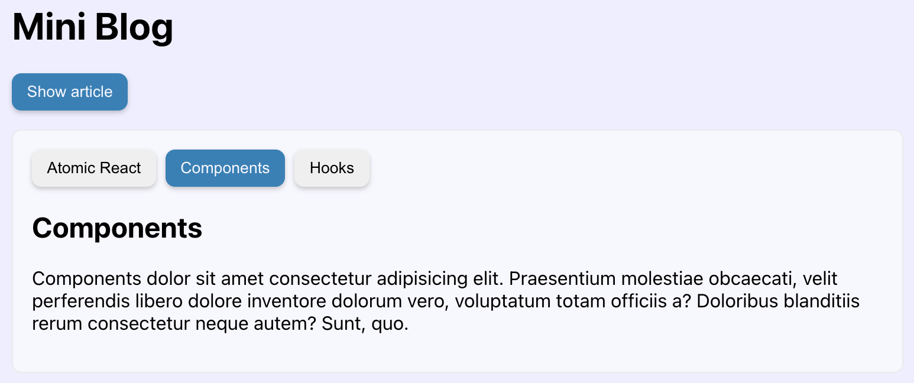

# ⚛️ React Master - Mini blog: État dérivé (Exercice)

> Dans cet énoncé tu trouvra:
>
> 1 ℹ️ information<br>
> 1 💡 indice

## Sommaire

<!-- no toc -->
-   [Notions de l'exercice](#notions-de-lexercice)
-   [Consignes](#consignes)
-   [Correction](#correction)

## Notions de l'exercice

-   Division de l'interface en composants
-   Les `props`
-   Le `state`
-   `PropTypes`
-   État dérivé

## Consignes

Pour réaliser cet exercice, tu vas devoir suivre les instructions suivantes:

Tu peux taper la commande suivante dans ton terminal:

```bash
git clone git@github.com:Atomic-React/react-master-mini-blog.git
```

Ensuite, rends toi dans le dossier avec la commande suivante:

```bash
cd react-master-mini-blog
```

Accède à la branche de l'exercice en exécutant la commande:

```bash
git switch ex03/exercise
```

Puis installes les dépendances avec la commande:

```bash
npm install
```

Tu peux maintenant te rendre sur l'URL <http://localhost:5173>. Tu vera que la page est au même état qu'à la fin de la correction du dernier exercice.

Dans cet exercice, tu vas devoir créer et intégrer des composants à partir de zéro.

**Penses à typer les `props` de tes composants avec `PropTypes`.**

Tu dois réaliser, en dessous des éléments existants, un système d'onglets (_"tabs"_ en anglais) permettant d'afficher différents articles:



Utilise ce tableau pour le titre des onglets et le contenu des articles:

```jsx
const tabs = [
	{
		id: 1,
		title: 'Atomic React',
		content: <Article title="Atomic React">
			<p>
				Atomic React dolor sit amet consectetur adipisicing elit. Praesentium molestiae obcaecati, velit perferendis libero dolore inventore dolorum vero, voluptatum totam officiis a? Doloribus blanditiis rerum consectetur neque autem? Sunt, quo.
			</p>
		</Article>,
	},
	{
		id: 2,
		title: 'Components',
		content: <Article title="Components">
			<p>
				Components dolor sit amet consectetur adipisicing elit. Praesentium molestiae obcaecati, velit perferendis libero dolore inventore dolorum vero, voluptatum totam officiis a? Doloribus blanditiis rerum consectetur neque autem? Sunt, quo.
			</p>
		</Article>,
	},
	{
		id: 3,
		title: 'Hooks',
		content: <Article title="Hooks">
			<p>
				Hooks dolor sit amet consectetur adipisicing elit. Praesentium molestiae obcaecati, velit perferendis libero dolore inventore dolorum vero, voluptatum totam officiis a? Doloribus blanditiis rerum consectetur neque autem? Sunt, quo.
			</p>
		</Article>,
	},
];
```

Le fichier `index.css` a été mis à jour avec des nouvelles classes, notamment une classe `btn--light` pour afficher les boutons en gris clair par défaut.

Tu remarques que le bouton de l'article actuellement visionné est en bleu.

L'article qui doit être affiché par défaut, c'est à dire au chargement de la page, doit être le deuxième.

Le numéro de l'article affiché par défaut doit être personnalisable. C'est à dire qu'en tant que développeur, si j'utilises ton composants d'onglets, je dois être capable via une `props` de choisir le numéro de l'article que je souhaite voir s'afficher par défaut.

Renseignes-toi sur les états dérivés (_"derived state"_ en anglais), cela peut t'être utile pour cet exercice.

Penses aux cas particuliers:

-   Que se passe-t-il si on ne défini pas de numéro d'article à afficher par défaut ?
-   Que se passe-t-il si on ne défini pas de contenu à afficher pour les articles ?
-   Que se passe-t-il si le tableau `tabs` fourni plus haut est vide ?

À toi de repérer ces différents cas et de les traiter de la façon dont il semble bon de le faire.

Bon courage ! 💪

## Correction

Je dispose déjà du tableau contenant les articles à afficher dans les onglets. Ce qui veut dire que je connais la structure attendue pour chaque onglet.

Je vais donc procéder en mode "déclaratif" depuis `App` pour développer les composants dont j'ai besoin.

Je veux afficher mes articles dans des onglets et pouvoir choisir depuis `App` l'onglet qui sera affiché par défaut, c'est à dire au chargement de la page.

Je suppose donc que je vais avoir besoin d'un composant que je vais appeler `Tabs` qui va avoir une propriété `defaultActiveTabId` qui prendra le numéro de la position de l'article à afficher par défaut, et une propriété `tabs`, qui recevera le tableau des onglets en valeur.

```jsx
const App = () => {
  const [ isArticleDisplayed, setIsArticleDisplayed ] = useState(false);

  const handleToggleArticle = () => {
	setIsArticleDisplayed(!isArticleDisplayed);
  };

  return (
	<>
		<h1>Mini Blog</h1>
		<Button
			variant={ isArticleDisplayed ? 'danger' : 'primary' }
			type="button"
			onClick={ handleToggleArticle }
		>
			{ isArticleDisplayed ? 'Hide' : 'Show' } article
		</Button>
		{
			isArticleDisplayed &&
			<Article title="My Article">
				<p>
					Lorem ipsum dolor sit amet consectetur adipisicing elit. Praesentium molestiae obcaecati, velit perferendis libero dolore inventore dolorum vero, voluptatum totam officiis a? Doloribus blanditiis rerum consectetur neque autem? Sunt, quo.
				</p>
			</Article>
		}
		<Tabs defaultActiveTabId={ 2 } tabs={ tabs } />
	</>
  );
};

```

C'est le composant `Tabs` qui va gérer toute la logique des onglets. On verra pourquoi il est jusdicieux de procéder ainsi dans quelques instants.

On va maintenant créer un fichier `Tabs.jsx` dans le dossier `components/`:

```JSX
const Tabs = ({ defaultActiveTabId, tabs }) => {

	return (
		<div>
		</div>
	);
};

export default Tabs;
```

Je vais ensuite l'importer dans `App`:

```jsx
import Tabs from './components/Tabs';
```

Puis je vais renseigner le HTML avec les classes CSS fournies:

```JSX
const Tabs = ({ defaultActiveTabId, tabs }) => {

return (
		<div className="tabs-container">
			<div className="tabs-buttons-container">
				{/* Buttons */}
			</div>
			{/* Content */}
		</div>
	);
};

export default Tabs;
```

Affichons ensuite les boutons. Pour cela nous pouvons utiliser le composant `Button` déjà existant:

```JSX
const Tabs = ({ defaultActiveTabId, tabs }) => {

return (
		<div className="tabs-container">
			<div className="tabs-buttons-container">
				{
					tabs.map(({ title, id }) => <Button key={ id }>{ title }</Button>)
				}
			</div>
			{/* Content */}
		</div>
	);
};

export default Tabs;
```

Pour chaque `tab` du tableau `tabs`, on affiche un bouton avec le titre à l'intérieur.

Si le bouton apparaît en bleu c'est normal, on s'occupera d'ajuster le `variant` du bouton après.

Ensuite il faut être capable d'afficher l'article par défaut en fonction de la propriété `defaultActiveTabId` puis de changer d'article lorsque l'on clique sur un bouton d'onglet.

Pour faire cela, nous allons utiliser le principe de _derived state_ (état dérivé).

C'est à dire que nous allons initialiser une propriété de `state` avec comme valeur initiale la valeur d'une `props`:

```jsx
const Tabs = ({ defaultActiveTabId, tabs }) => {

	const [ activeTabId, setActiveTabId ] = useState(defaultActiveTabId); // État dérivé d'une valeur d'une props

	return (
		<div className="tabs-container">
			<div className="tabs-buttons-container">
				{
					tabs.map(({ title, id }) => <Button key={ id }>{ title }</Button>)
				}
			</div>
			{/* Content */}
		</div>
	);
};

export default Tabs;
```

Pour afficher le contenu, il ne reste plus qu'à trouver l'article dont l'`id` est égal à celui dans `activeTabId`.

```jsx
const Tabs = ({ defaultActiveTabId, tabs }) => {

	const [ activeTabId, setActiveTabId ] = useState(defaultActiveTabId); // État dérivé d'une valeur d'une props

	return (
		<div className="tabs-container">
			<div className="tabs-buttons-container">
				{
					tabs.map(({ title, id }) => <Button key={ id }>{ title }</Button>)
				}
			</div>
			{
				tabs.find(tab => tab.id === activeTabId).content
			}
		</div>
	);
};

export default Tabs;
```

En principe, le contenu de l'article n°2 devrait s'afficher.

Il faut maintenant permettre à l'utilisateur de changer d'article actif en cliquant sur les boutons.

Pour se faire, nous allons avoir besoin d'une fonction qui prenne en argument l'`id` de l'article à afficher:

```jsx
{
	tabs.map(({ title, id }) => <Button key={ id } onClick={ handleChangeTab(id) }>{ title }</Button>)
}
```

Cependant, nous savons que si nous exécutons directement cette fonction dans le `onClick`, elle va s'exécuter dès le chargement du composant. Il nous faut alors une fonction curryfiée:

```jsx
const handleChangeTab = (tabId) => () => {
	setActiveTab(tabId);
};
```

Pour rappel, une fonction curryfiée est une fonction qui retourne une fonction. Ici nous avons une fonction `handleChangeTab` qui prend en argument `tabId` et qui est exécutée pour chaque bouton au chargement du composant.

Cette fonction retourne une fonction anonyme qui est placée en valeur du `onClick`. Cette fonction anonyme sera alors exécutée au moment du clic sur le bouton.

Il ne nous reste plus qu'à gérer le système de changement de couleur sur les boutons et afficher le bouton de l'article actif en bleu:

```jsx
{
	tabs.map(({ title, id }) => <Button key={ id } variant={ id === activeTab ? 'primary' : 'light' } onClick={ handleChangeTab(id) }>{ title }</Button>)
}
```

À ce moment là tout fonctionne mais il reste quelque chose à gérer.

Que se passe-t-il si on transmet un tableau `tabs` vide ? Ou alors si on n'indique pas d'onglet actif par défaut ?

Le composant va planter.

J'ai donc préparé une fonction qui va nous permettre d'initialiser le contenu à afficher d'après tous ces cas particuliers:

```jsx
// Ce fonction reçois tabs qui par défaut est vide, et activeTabId qui par défaut est égal à 0
const getTabContent = (tabs = [], activeTabId = 0) => {
	// Si le tableau tabs est vide
	if (tabs.length === 0) {
		// On retourne cette chaine de caractères
		return 'No content.';
	}

	// Si artive tab est falsy
	if (!activeTabId) {
		// On retourne le contenu du premier article
		return tabs[0].content;
	}

	// Sinon, on cherche le contenu de l'article demandé
	const foundTabContent = tabs.find(tab => tab.id === activeTabId)?.content;
	// Si le contenu existe, on le retourne, sinon, on retourne 'No content.'
	return foundTabContent || 'No content.';
}
```

Nous pouvons donc utiliser cette fonction pour initialiser le contenu à afficher par défaut, que l'on peu placer dans le `state`:

```jsx
const [ activeTab, setActiveTab ] = useState(defaultActiveTab);
const [ currentTabContent, setCurrentTabContent ] = useState(getInitialTabContent(tabs, defaultActiveTab));
```

Il faut donc mettre à jour le JSX en conséquences:

```jsx
return (
	<div className="tabs-container">
		<div className="tabs-buttons-container">
			{
				tabs.map(({ title, id }) => <Button key={ id } variant={ id === activeTab ? 'primary' : 'light' } onClick={ handleChangeTab(id) }>{ title }</Button>)
			}
		</div>
		{ currentTabContent }
	</div>
);
```

Et il faut également mettre à jour la fonction `handleChangeTab` pour qu'au moment du clique sur un bouton, le contenu dans le `state` soit mis à jour:

```jsx
const handleChangeTab = (tabId) => () => {
	setActiveTab(tabId);
	setCurrentTabContent(getTabContent(tabs, tabId));
};
```

Ce qui nous donne finalement ce fichier:

```jsx
import { useState } from 'react';
import Button from './Button';

const getTabContent = (tabs = [], activeTabId = 0) => {
	if (tabs.length === 0) {
		return 'No content.';
	}
	if (!activeTabId) {
		return tabs[0].content;
	}
	const foundTabContent = tabs.find(tab => tab.id === activeTabId)?.content;
	return foundTabContent || 'No content.';
}

const Tabs = ({ defaultActiveTab, tabs }) => {

	const [ activeTab, setActiveTab ] = useState(defaultActiveTab);
	const [ currentTabContent, setCurrentTabContent ] = useState(getTabContent(tabs, defaultActiveTab));

	const handleChangeTab = (tabId) => () => {
		setActiveTab(tabId);
		setCurrentTabContent(getTabContent(tabs, tabId));
	};

	return (
		<div className="tabs-container">
			<div className="tabs-buttons-container">
				{
					tabs.map(({ title, id }) => <Button key={ id } variant={ id === activeTab ? 'primary' : 'light' } onClick={ handleChangeTab(id) }>{ title }</Button>)
				}
			</div>
			{ currentTabContent }
		</div>
	);
};

export default Tabs;
```

Dans l'énoncé on nous demandait de nous occuper des `PropTypes`, ajoutons les:

```jsx
import { useState } from 'react';
import { arrayOf, node, number, shape, string } from 'prop-types';
import Button from './Button';

const getTabContent = (tabs = [], activeTabId = 0) => {

	// ...
}

const Tabs = ({ defaultActiveTab, tabs }) => {

	// ...
};

export default Tabs;

Tabs.propTypes = {
	defaultActiveTab: number,
	tabs: arrayOf(shape({
		id: number.isRequired,
		title: string.isRequired,
		content: node
	})),
};

Tabs.defaultProps = {
	defaultActiveTab: 0,
	tabs: [],
};
```

Ici, les deux propriétés sont optionnelles.

`tabs` est de type "tableau" de "quelque chose". Ce quelque chose est un objet de la forme suivante:

```jsx
{
	id: number.isRequired,
	title: string.isRequired,
	content: node
}
```

L'`id` et le `title` sont requis mais pas `content`.

<!-- TODO => Montrer les rerendus si on avait géré le state dans App -->

Un dernier mot sur le `state`.

Pourquoi le gérer dans un composant `Tabs` et pas dans le composant `App` ?

Tout d'abord, si nous avions une application bien plus complexe, gérer tous les états dans `App` rendrait notre application terriblement difficile à maintenir.

Ensuite, elle ne serait pas du tout optimisée.

Ajoute ce `console.log` dans `Tabs`:

```jsx
const Tabs = ({ defaultActiveTab, tabs }) => {

	// ...

	console.log('RENDER TABS');

	return (
		// ...
	);
};
```

Puis clique sur le bouton `Show/Hide article` que nous avions développé lors du premier exercice.

Tu verra dans ta console que chaque fois que tu cliques sur ce bouton, le composant `Tabs` est réexécuté. On dit qu'il est re-rendu.

Du fait qu'il y a une mise à jour du `state` dans `App`, **React** réexécute le composant pour pouvoir le mettre à jour dans l'interface.

Cette réexécution, ce re-rendu du composant `App` entraine le re-rendu de tous ses composants enfants.

Maintenant mets le même `console.log` dans `App`:

```jsx
const App = () => {

	// ...

	console.log('RENDER APP');

  return (
	// ...
  );
};
```

Et clique sur les boutons des onglets.

Tu verra dans la console que seul le `console.log` de `RENDER TABS` apparaît. `RENDER APP` n'apparaît pas car `App` n'est pas re-rendu. Cela ne concerne que `Tabs` et ses enfants.

Ce fonctionnement est vraiment très important à connaître et à comprendre pour pouvoir créer de bonnes applications optimisées avec **React**.

Il est très important à connaître et à comprendre pour pouvoir faire un découpage optimal de l'application en composants et savoir placer et gérer le `state` correctement.
