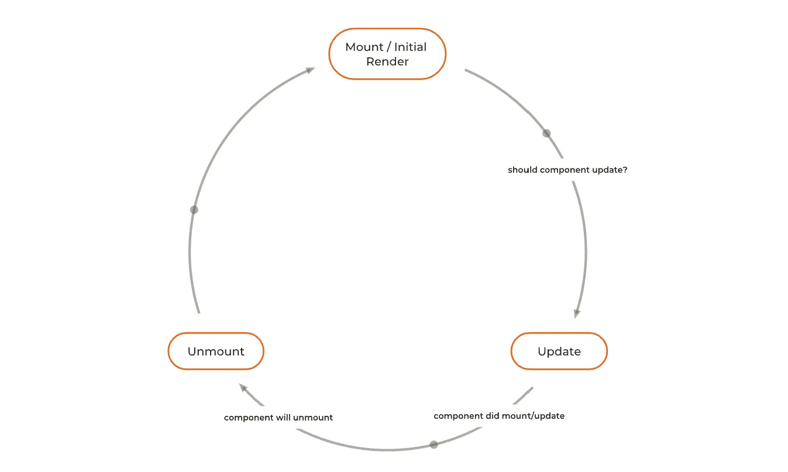

# ⚛️ React Master - Mini blog: Découverte du cycle de vie (Correction)

## Sommaire

<!-- no toc -->
-   [Notions de l'exercice](#notions-de-lexercice)
-   [Consignes](#consignes)
-   [Correction](#correction)

## Notions de l'exercice

-   Les `props`
-   Le `state`
-   Le cycle de vie

## Consignes

Pour réaliser cet exercice, tu vas devoir suivre les instructions suivantes:

Tu peux taper la commande suivante dans ton terminal:

```bash
git clone git@github.com:Atomic-React/react-master-mini-blog.git
```

Ensuite, rends toi dans le dossier avec la commande suivante:

```bash
cd react-master-mini-blog
```

Accède à la branche de l'exercice en exécutant la commande:

```bash
git switch ex04/exercise
```

Puis installes les dépendances avec la commande:

```bash
npm install
```

Tu peux maintenant te rendre sur l'URL <http://localhost:5173>. Tu verra qu'il y a eu une légère modification: il n'y a plus l'article qui était affiché ou masqué grâce au bouton. Désormais, le bouton affiche et masque l'ensemble des onglets et des articles.

Et si tu te rends sur le fichier `Tabs.jsx`, tu verra que l'affichage du contenu dans le JSX a été remplacé par un `tabs.map`. Cette modification a été faite pour les besoins de l'exercice. Tu n'as pas besoin de t'en préoccuper ni d'y toucher.

Dans cet exercice, tu vas devoir intégrer une nouvelle fonctionnalité: afficher une horloge indiquant combien de temps l'utilisateur passe à lire un article dans les onglets.

L'idée, c'est qu'au moment où l'utilisateur charge un article, un chronomètre démarre et affiche en temps réelle la durée de consultation de l'article.

Si l'utilisateur change d'article, un nouveau chronomètre démarre.

Ce chronomètre devra être affiché juste en dessus du titre de l'article au format _"HH:mm:ss"_

Pour réaliser cet exercice, tu aura besoin de te familiariser avec ce que l'on appelle le "cycle de vie" (_"life cycle"_ en anglais) des composants.

**React** te met à disposition un _hook_ permettant d'exploiter les fonctionnalités de ce cycle de vie. Ce hook s'appelle `useEffect`.

Voici le lien vers la documentation de **React** qui parle du cycle de vie des composants: <https://react.dev/learn/lifecycle-of-reactive-effects#the-lifecycle-of-an-effect>

Voici le lien vers la documentation de **React** qui parle de `useEffect`: <https://react.dev/reference/react/useEffect>

<details>
 <summary>💡 <b>Indice</b></summary>

 > Si tu te rends compte que l'état de ton horloge ne se met pas à jour correctement, retourne sur la documentation du `useState`.
 >
 > Ceci peut t'aider: <https://react.dev/reference/react/useState#updating-state-based-on-the-previous-state>

</details>

Bon courage ! 💪

## Correction

Pour cet exercice, nous devons réaliser une horloge, un chronomètre, qui sera affiché sur chaque article.

Nous allons donc créer un composant `Timer.jsx`:

```jsx
const Timer = () => {
	
	return (
		<p>TIMER</p>
	);
};

export default Timer;
```

Ce composant devra être intégré au composant `Article`:

```jsx
import Timer from './Timer';

const Article = ({ title, children }) => {

	return (
		<div>
			<h2>{ title }</h2>
			<Timer />
			{ children }
		</div>
	);
};
```

En principe, si on retourne dans le navigateur pour observer le résultat, le texte _"TIMER"_ devrait être affiché sous le titre de chaque article.

Ici, l'intérêt de créer un nouveau composant spécifique c'est de séparer la logique des composants. Une horologe peut être utilisée à n'importe quel endroit de l'application. Elle n'est pas spécifique au composant `Article`.

Donc si je veux pouvoir la réutiliser dans d'autres composants, j'ai tout intérêt à faire de cette horloge un composant à part entière.

Nous savons ensuite que nous allons avoir besoin de placer une propriété dans le `state` du composant `Timer` qui va contenir le temps qui est en train de s'écouler:

```jsx
const Timer = () => {

	const [ elaspedTime, setElapsedTime ] = useState(0);

	return (
		<p>TIMER</p>
	)
};
```

Par défaut, nous sommes à `0` seconde.

Nous pouvons dès maintenant ajouter une fonction permettant de convertir le nombre de secondes au format _"HH:mm:ss"_:

```jsx
const convertSecondsToHMS = (timeInSeconds) => {
	timeInSeconds = Number(timeInSeconds);
	const h = Math.floor(timeInSeconds / 3600);
	const m = Math.floor(timeInSeconds % 3600 / 60);
	const s = Math.floor(timeInSeconds % 3600 % 60);

	const hDisplay = h < 10 ? '0' + h : h;
	const mDisplay = m < 10 ? '0' + m : m;
	const sDisplay = s < 10 ? '0' + s : s;

	return `${hDisplay}:${mDisplay}:${sDisplay}`;
};

const Timer = () => {

	const [ elaspedTime, setElapsedTime ] = useState(0);

	return (
		<p>{ convertSecondsToHMS(elaspedTime) }</p>
	)
};
```

L'utilisation de cette fonction se fait au moment de l'affichage dans le `JSX` et non directement au niveau du `state` ou de la mise à jour de celui-ci.

Le `state` doit contenir la valeur la plus brute possible pour qu'elle soit plus simple exploitable ensuite.

C'est maintenant que la question du cycle de vie se pose.

Voilà un schéma qui te montre visuellement ce qu'est le cycle de vie et comment il se manifeste:



Et c'est dans ce schéma que le `useEffect` intervient.

Grâce à lui, nous allons pouvoir suivre chaque étape du cycle de vie d'un composant:

-   Le montage du composant (rendu initial)
-   La mise à jour d'un composant (mise à jour du `state` ou des `props`)
-   Le démontage d'un composant (la destruction, le composant est retiré du DOM)

Le rôle de `useEffect` est de nous permettre d'ajouter un effet qui se produirait à la suite d'un ou plusieurs de ces trois étapes du cycle de vie.

Un effet, comme dans la vie courante, fait toujours suite à une cause.

Par exemple: _"CAUSE: Le composant se monte, EFFET: L'horloge démarre"_

Et c'est ce que nous allons faire en utilisant `useEffect` dans le composant `Timer`.

Ajoutons le `useEffect` avec un `console.log` pour observer à quel moment il se déclenche:

```jsx
const Timer = () => {

	const [ elaspedTime, setElapsedTime ] = useState(0);

	useEffect(() => {
		console.log('USE EFFECT');
	});

	return (
		<p>{ convertSecondsToHMS(elaspedTime) }</p>
	)
};
```

On remarque que lorsque le composant `Article` se monte, le composant `Timer`, étant enfant de `Article`, se monte également, ce qui déclenche le `useEffect`.

S'il y a deux fois `USE EFFECT` dans la console, c'est normal. C'est à cause du `StrictMode` dans `main.jsx`. Nous en reparlerons plus tard.

Nous voulons que dès lors que le composant se monte, un `setInterval` déclenche une mise à jour du `state` à chaque seconde:

```jsx
const Timer = () => {

	const [ elaspedTime, setElapsedTime ] = useState(0);

	useEffect(() => {
		setInterval(() => {
			console.log('INTERVAL');
			setElapsedTime(elaspedTime + 1);
		}, 1000);
	});

	return (
		<p>{ convertSecondsToHMS(elaspedTime) }</p>
	)
};
```

J'ai rajouté un `console.log` dans le `setInterval` pour qu'on puisse mieux se repérer.

Maintenant si on ouvre les articles, on verra que l'horloge se déclenche et qu'elle se met à jour chaque seconde.

Le problème ici, si on regarde dans la console, c'est qu'il y a de plus en plus d'`INTERVAL`. Au lieu d'en avoir un à chaque secondes, il y en a de plus en plus.

Cela signifie que plusieurs `setInterval` viennent s'exécuter en parallèle et qu'ils sont de plus en plus nombreux.

Nous avons un bug ici qui engendrera de lourds problèmes de performances très très vite.

Cela risque de faire saturer la mémoire du navigateur et de le faire planter.

Ceci est dû au fait que le `useEffect` se déclenche d'abord au montage du composant, mais il se déclenche AUSSI à chaque mise à jour du `state`.

Et comme nous mettons à jour le `state` dans `useEffect`, `useEffect` se redéclenche sans cesse et déclenche avec lui des `setInterval`.

Il faut donc indiquer à `useEffect` de s'exécuter qu'une seule fois, seulement au montage du composant.

Pour ce faire, il faut ajouter un second argument à `useEffect`, un tableau vide:

```jsx
useEffect(() => {
	setInterval(() => {
		console.log('INTERVAL');
		setElapsedTime(elaspedTime + 1);
	}, 1000);
}, []); // ICI
```

Ce tableau est appelé _"Tableau de dépendances"_. Nous en reparlerons dans la prochaine leçon. Pour le moment, admet seulement que c'est le moyen permettant d'indiquer au `useEffect` de se déclencher, seulement et uniquement lorsque le composant se monte.

Si on essaie de nouveau, on verra dans la console que `INTERVAL` apparaît deux par deux. Encore une fois, c'est à cause du `StrictMode` qui double tous les `console.log`.

En réalité il n'y a bien qu'un seul interval en cours d'exécution.

Cependant, la correction que l'on vient d'apporter au `useEffect` vient d'engendrer un nouveau problème: L'horloge ne se met plus à jour correctement, elle reste bloquée à une seconde.

Ceci est dû au fait que `setInterval` s'exécute en parallèle du composant et non plus directement dans le composant. C'est un processus annexe.

Au moment où il a été déclenché, `elaspedTime` vallait `0`. Il a capturé cette valeur et l'a emmené avec lui dans son processus.

Donc quand il fait `elaspedTime + 1`, en réalité il fait `0 + 1` sans arrêt.

```jsx
useEffect(() => {
	setInterval(() => {
		// elaspedTime = 0
		console.log('INTERVAL');
		setElapsedTime(elaspedTime + 1); // 0 + 1
	}, 1000);
}, []);
```

Il faudrait que l'on puisse transmettre à `setInterval` la dernière valeur à jour du `state`.

Pour faire cela, **React** met à notre disposition la possibilité d'ajouter un fonction anonyme en tant que premier argument du _setter_ (fonction de mise à jour du `state`) qui nous renvoie la dernière valeur à jour du `state`.

Cela donnerai ceci:

```jsx
useEffect(() => {
	setInterval(() => {
		console.log('INTERVAL');
		setElapsedTime((prevElapsedTime) => prevElapsedTime + 1); // Dernière valeur + 1
	}, 1000);
}, []);
```

Cette fonction doit, comme tu peux le voir ici, retourner la nouvelle valeur à insérer dans le `state`.

Notre horloge devrait maintenant être réparée.

Il y a un dernier souci à résoudre.

Si on clique sur les autres onglets, le temps de l'horologe se remet bien à `0` dans l'interface, grâce au fait que le composant `Article` précédent soit détruit et remplacé par un nouveau, mais dans la `console`, les `INTERVAL` continuent de s'exécuter.

C'est d'autant plus flagrant si on clique sur le bouton permettant de fermer les articles.

Et si on s'amuse à changer souvent d'onglet, nous verrons qu'il y a aura de nouveaux intervals qui vont se créer et s'accumuler.

Voilà encore un problème potentiel de performances.

Comme je l'ai dit, `setInterval` lance un processus indépendant du composant.

Même si le composant est détruit, il continue de s'exécuter.

C'est pourquoi il faut dire à ce processus de s'arrêter lorsque le composant se détruit.

Pour cela, nous pouvons ajouter à la fin du `useEffect` une fonction anonyme qui doit être retournée:

```jsx
useEffect(() => {
	setInterval(() => {
		console.log('INTERVAL');
		setElapsedTime(elaspedTime + 1);
	}, 1000);

	return () => {
		// s'exécute à la destruction du composant
	}
}, []);
```

Cette fonction sera exécutée au moment où le composant sera détruit.

Nous pouvons donc utiliser la fonction `clearInterval` pour nettoyer l'interval en cours et arrêter le processus.

```jsx
useEffect(() => {
	setInterval(() => {
		console.log('INTERVAL');
		setElapsedTime(elaspedTime + 1);
	}, 1000);

	return () => {
		clearInterval();
	}
}, []);
```

Mais ce n'est pas suffisant ! Il faut indiquer au `clearInterval` quel processus arrêter. Car plusieurs `interval` pourraient être exécutés en simultané. Il faut donc lui indiquer lequel arrêter en lui passant l`id` de l'interval en cours en argument.

Pour le récupérer, on peut placer `setInterval` dans une variable que l'on aura au préalable déclaré de façon globale dans le fichier. Cela donne ceci:

```jsx
let intervalId; // Variable destinée à contenir l'id du processus de l'interval

const Timer = () => {

	const [ elaspedTime, setElapsedTime ] = useState(0);

	useEffect(() => {
		// On enregistre l'id du processus de l'interval
		intervalId = setInterval(() => {
			console.log('INTERVAL');
			setElapsedTime((prevElapsedTime) => prevElapsedTime + 1);
		}, 1000);
		
		return () => {
			// À la destruction du composant, on nettoie l'interval dont l'id est enregistré dans `intervalId`
			clearInterval(intervalId);
		}
	}, []);

	return (
		<p>{ convertSecondsToHMS(elaspedTime) }</p>
	)
};
```

Désormais, il n'y a qu'un seul interval actif lorsque l'on change d'onglet, et plus aucun interval actif si on ferme les articles.

### IMPORTANT

Il est primordial de nettoyer ce genre de processus utilisé dans un composant lors de la destruction de ce composant. Autrement, cela pourrait occasionner de lourds problèmes de performances. Et c'est tout aussi valable avec les `timeout` et les abonnements à des flux de données.

Nous aurons l'occasion de revenir sur ce sujet dans d'autres exercices.
