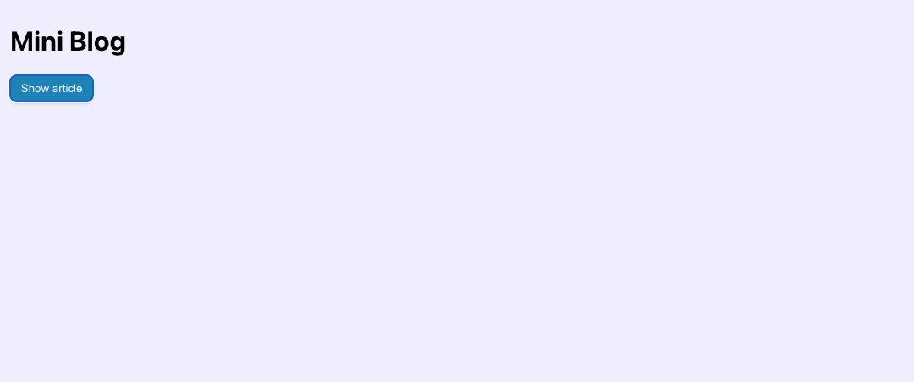

# ⚛️ React Master - Mini blog: Gérer l'état d'un composant (Exercice)

> Dans cet énoncé tu trouvra:
>
> 1 ℹ️ information<br>
> 1 💡 indice

## Sommaire

1.   [Notions](#notions-de-lexercice)
2.   [Consignes](#consignes)
3.   [Correction](#correction)

## Notions de l'exercice

*   Affichage conditionnel
*   Événements
*   Gestion d'état

## Consignes

Pour cet exercice, tu vas devoir cloner le dépôt dont le lien s'affiche ci-dessous:

> ⚠️ Lien du dépôt à ajouter

Tu peux taper la commande suivante dans ton terminal:

```bash
git clone git@github.com:Atomic-React/react-master-mini-blog.git
```

Ensuite, rends toi dans le dossier avec la commande suivante:

```bash
cd react-master-mini-blog
```

Accède à la branche de l'exercice en exécutant la commande:

```bash
git switch ex01/exercise
```

Puis installes les dépendances avec la commande:

```bash
npm install
```

Tu peux maintenant te rendre sur l'URL <http://localhost:5173>. Tu vera qu'il n'y a qu'une page branche.

Ta mission désormais va être de réaliser la page suivante:



Tu peux y apercevoir un titre et un bouton bleu.

> ℹ️ **Information**
>
> Le CSS t'es déjà donné. Regarde le fichier `index.css` dans le dossier `src/`, tu y trouvera tout ce dont tu as besoin.

La seconde étape va être de permettre à l'utilisateur de faire apparaître un article lors du clic sur le bouton _"Show article"_ comme ceci:


Remarque au passage que le bouton _"Show article"_ s'appelle désormais _"Hide article"_ et que sa couleur a changé.

Lorsque l'utilisateur clique à nouveau sur le bouton, l'article doit disparaître de la page et le bouton doit récupérer son état initial.

<details>
 <summary>💡 <b>Indice</b></summary>

 > Pour pouvoir mettre à jour la vue suite au clic de l'utilisateur, tu as besoin de te renseigner sur le hook `useState`.
 >
 > Tu n'as pas besoin de savoir exactement ce qu'est un hook à ce stade. Pars seulement du principe qu'il s'agit d'une simple fonction.
 >
 > Tu vas également avoir besoin de comprendre ce qu'est le `state` d'un composant et pourquoi il est nécessaire.
 >
 > Voici le lien vers la documentation de React qui explique le rôle du `state`: <https://react.dev/learn/state-a-components-memory>
 >
 > Voici le lien vers la page de la documentation de React qui parle de `useState`: <https://react.dev/reference/react/useState>

</details>

## Correction

Tu peux consulter la correction écrite ici: <https://github.com/Atomic-React/react-master-mini-blog/tree/ex01/correction>

Ou suivre la correction en vidéo ici: _Bientôt disponible_
